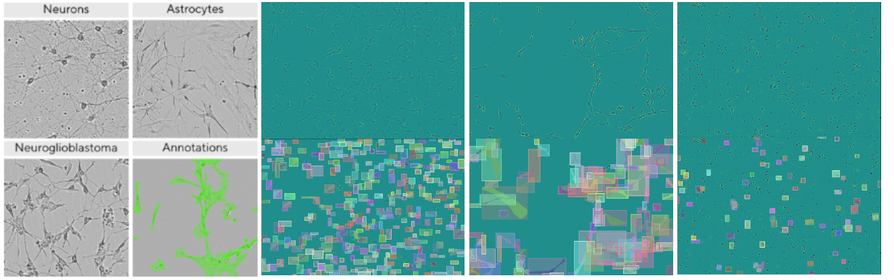
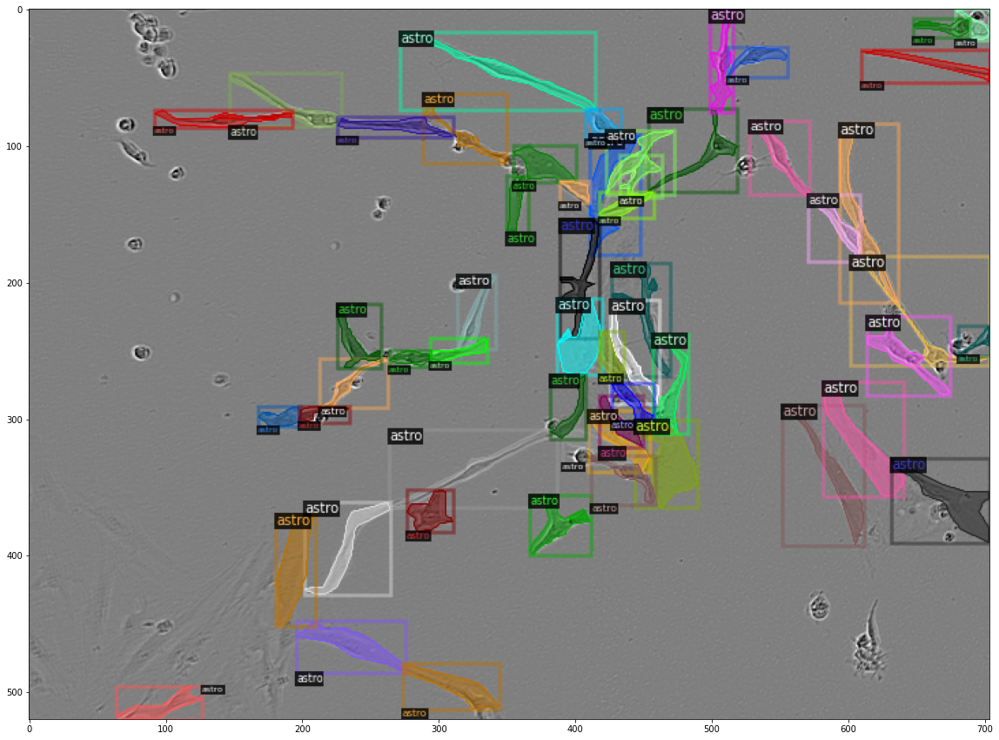
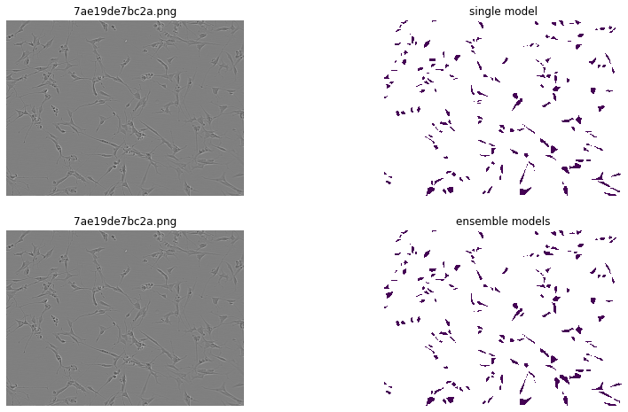
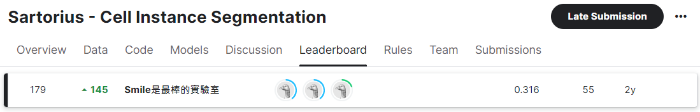
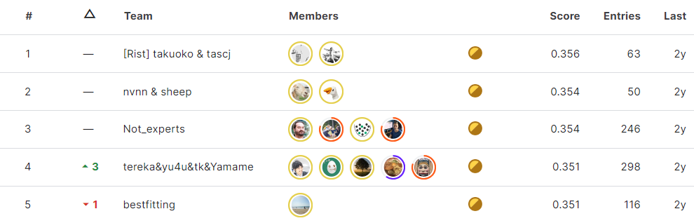

#  Sartorius Cell Instance Segmentation (Kaggle Competition)

 [Competition Page](https://www.kaggle.com/competitions/sartorius-cell-instance-segmentation)

>  NCKU "Machine Learning" Final Project  
>  Focus: Instance segmentation of neural cells (SH-SY5Y) using Mask R-CNN & ensembling

---

##  Motivation

Neurological disorders are a leading global cause of mortality. Precise segmentation of individual neural cells allows researchers to analyze treatment effects and accelerate drug development. This project tackles the **challenging SH-SY5Y neural cell segmentation** task using AI-assisted methods.

---

##  Dataset Access

Download from Kaggle:
```bash
kaggle competitions download -c sartorius-cell-instance-segmentation
```

<p align="center">
  
</p>

Backup links:
- [ Dataset (Google Drive)](https://drive.google.com/file/d/1n76PHLwMhEj7LdhSUDbYDPOv75D06bkU/view?usp=sharing)
- [ Annotation JSON Files](https://drive.google.com/drive/folders/15_k-MsnejPnD18CqypdHxiF3MBW0hu1D?usp=sharing)

<p align="center">
  
</p>

---

##  Dependencies

Environment: `pytorch-21.06-py3` with Docker or local GPU runtime

```bash
sudo apt-get update
sudo apt-get install ffmpeg libsm6 libxext6 -y

pip install pycocotools
pip install 'git+https://github.com/facebookresearch/detectron2.git'
pip install fastcore ensemble-boxes nms
```

---

##  Methods Overview

Full details in [ sartorius_methods.pdf](https://github.com/JianJiaXian/Sartorius-Cell-Instance-Segmentation/blob/main/sartorius_methods.pdf)

1. Mask R-CNN (ResNet50 / ResNeXt101)
2. Model Ensembling
3. Image Normalization
4. Data Augmentation
5. Test-Time Augmentation (TTA)

---

##  Project Structure

| Script | Description |
|--------|-------------|
| `showimg.py` | Visualize annotations and images |
| `train.py` | Model training |
| `inference.py` | Run inference using `.pth` models |
| `ensemble_inference.py` | Apply model ensembling or TTA |

<p align="center">
  
</p>

---

##  Experiment Results

Details: [ experiment_result.pdf](https://github.com/JianJiaXian/Sartorius-Cell-Instance-Segmentation/blob/main/experiment_result.pdf)

###  Ablation Study

| No. | Backbone | Iterations | Ensemble | Normalization | Augment | TTA | mAP |
|-----|----------|------------|----------|---------------|---------|-----|-----|
| 1   | ResNet50 | 4,000      | –        | –             | –       | –   | 0.285 |
| 3   | R50+X101 | 4,000      | ✔️       | ✔️            | –       | –   | 0.293 |
| 5   | R50+X101 | 4,000      | ✔️       | –             | –       | ✔️  | 0.250 |

###  Training Results

| No. | Backbone | Iterations | Ensemble | mAP |
|-----|----------|------------|----------|-----|
| 3   | R50+R50  | 10,679     | ✔️       | 0.303 |
| 4   | R50+R50  | 11,679     | ✔️       | 0.304 |

---

##  Final Submission Result

-  Final public score: **0.316 mAP**
-  Rank: **179 / 1506**

<p align="center">
  
</p>

The top-5 teams achieved around **0.35 mAP**.

<p align="center">
  
</p>

---

##  Conclusion & Future Work

By leveraging **model ensembling**, **augmentation**, and **Mask R-CNN**, we achieved a strong result for neural cell segmentation.

 Future enhancements:
- Use **semi-supervised learning** with unlabeled images
- Apply **self-training** and pseudo-labeling to boost generalization
- Experiment with **transformer-based segmentation models**

---

